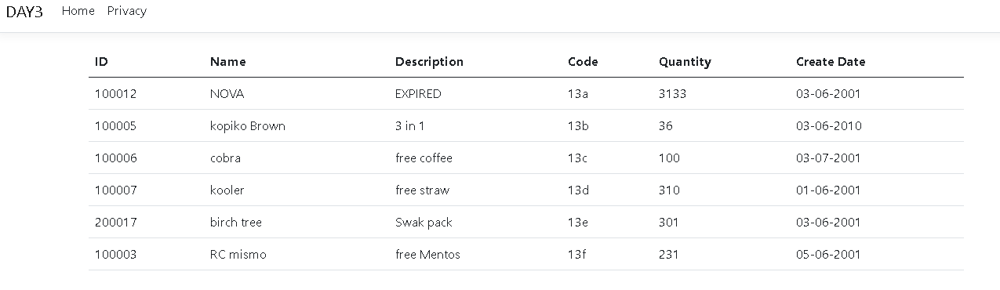

# DAY 3 Exercise
## product.cs
```
namespace DAY3.Model{
public class  Product
{
    public Product(int itemID, string itemName, string itemDescription, string itemCode, int quantity, string createDate)
    {
    this.ItemID = itemID;
    this.ItemName = itemName;
    this.ItemDescription = itemDescription;
    this.ItemCode = itemCode;
    this.Quantity = quantity;
    this.CreateDate = createDate; 
    }

    public int? ItemID {get; set;}
    public string? ItemName {get; set;}
    public string? ItemDescription {get; set;}
    public string? ItemCode {get; set;}
    public int? Quantity{get; set;}
    public string? CreateDate{get; set;}
  }
}
```
## HomeController.cs
```
using System.Diagnostics;
using Microsoft.AspNetCore.Mvc;
using DAY3.Models;
using DAY3.Model;


namespace PracticeWeb.Controllers;

public class HomeController : Controller
{
    public IActionResult Index()
    {
        Product product = new Product(
        12,
        "NOVA", 
        "EXPIRED", 
        "13A",
        31,
        "03-06-2001"
        );

        return View(product);
    }    
    public IActionResult Test(Product product) {
        return RedirectToAction("Index");
    }
}

```
## index.cshtml
```


@{
    ViewData["Title"] = "Home Page";
}
@using DAY3.Model
@{
    var listOfProduct = new List<Product>();
    
    listOfProduct.Add(new Product(100012,"NOVA", "EXPIRED", "13a", 3133, "03-06-2001"));
    listOfProduct.Add(new Product(100005,"kopiko Brown", "3 in 1", "13b", 36, "03-06-2010"));
    listOfProduct.Add(new Product(100006,"cobra", "free coffee", "13c", 100, "03-07-2001"));
    listOfProduct.Add(new Product(100007,"kooler", "free straw", "13d", 310, "01-06-2001"));
    listOfProduct.Add(new Product(200017,"birch tree", "Swak pack", "13e", 301, "03-06-2001"));
    listOfProduct.Add(new Product(100003,"RC mismo", "free Mentos", "13f", 231, "05-06-2001"));
}   
<table class="table table-hover">
    <thead>
        <tr>
            <th>ID</th>
            <th>Name</th>
            <th>Description</th>
            <th>Code</th>
            <th>Quantity</th>
            <th>Create Date</th>
        </tr>
    </thead>
    <tbody>
        @{
            foreach(var product in listOfProduct){
                <tr>
                <td>@product.ItemID</td>
                <td>@product.ItemName</td>
                <td>@product.ItemDescription</td>
                <td>@product.ItemCode</td>
                <td>@product.Quantity</td>
                <td>@product.CreateDate</td>
                </tr>
            }
        }
    </tbody>
</table>
```

# RETURN TO [ readme.md](README.md)