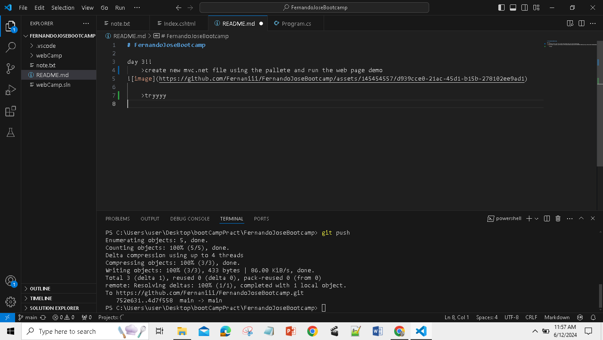

# FernandoJoseBootcamp
## **day 1**
=code 

=output


## **day 2**
    to be accomplish

## **day 3!!**
    >create new mvc.net file using the pallete and run the web page demo


image relative linking 
```
    
    
```


### trouble shooting
removing cached/nested repository
```
"git rm -r --cached [name of the folder]"

```


how to make read.md beautiful [Format readme.md](https://docs.github.com/en/get-started/writing-on-github/getting-started-with-writing-and-formatting-on-github/basic-writing-and-formatting-syntax).


[journey in learning github and git](/journal.txt)