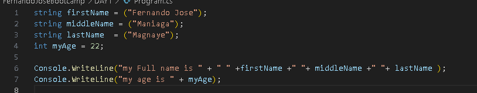
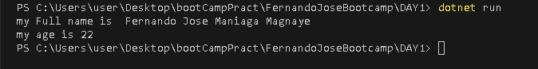
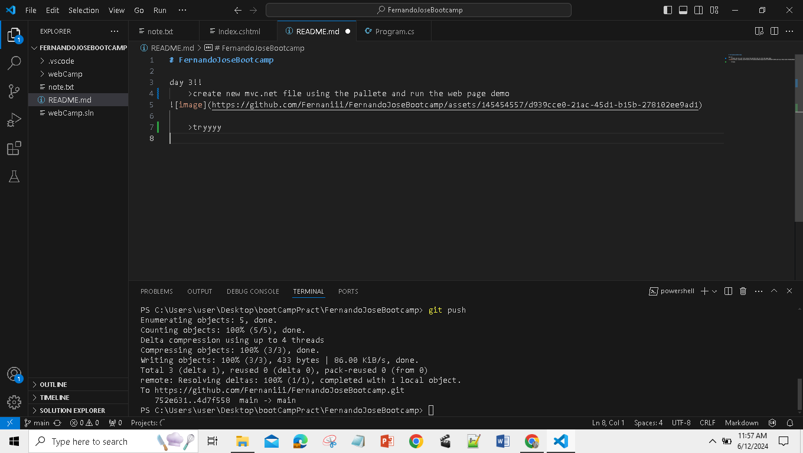

# FernandoJoseBootcamp :grinning:

   ## **day 1!** :upside_down_face: :poop: :banana:

   - [X] Basic Lesson 1: Create a console app solution in visual studio code that will print your full name, age and gender
     
     
   - [ ] Basic Lesson 2: Create decision logic with if statement

   - [ ] Basic Lesson 3: Comparing 3 numbers

   - [ ] Basic Lesson 4: Check if Even


   ## **day 2!** :baby: :trollface:
   - [x] create new mvc.net file using the pallete and run the web page demo
 

   ## **day 3!** :smile::knife:
   ### Create an inventory list screen
            
  - [ ] Create a new solution for your inventory list screen

  - [ ] Create an inventory model in the Model folder that has the properties ItemID, ItemName, ItemDescription, ItemCode, Quantity, and CreateDate.

  - [ ] Create a new controller and name it InventoryController.

  - [ ] Create a new method in the InventoryController and create a new view.

  - [ ] Create a list of your inventory model and add a dummy data.

  - [ ] Display the dummy datas in a table in your newly created view. 


   ### trouble shooting
   removing cached/nested repository
       ```
       git rm -r --cached [name of the folder]
       ```
   ### ADDITIONAL
   FILE relative linking 
      ```
       
       
      ```

 > [!NOTE]
 >see the other sample in journal including Note, Tip, Important, Warning and Caution
 >[GITHUB and GIT JOURNAL](journal.md)


   HOW TO MAKE README.md BEAUTIFUL look [Format readme.md](https://docs.github.com/en/get-started/writing-on-github/getting-started-with-writing-and-formatting-on-github/basic-writing-and-formatting-syntax).


