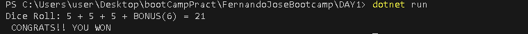
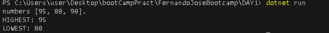
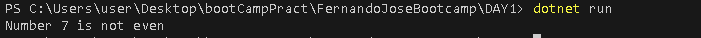
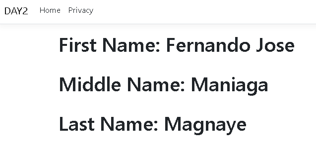

# FernandoJoseBootcamp :grinning:

   ## **day 1!** :upside_down_face: :poop: :banana:

   - [X] Basic Lesson 1: Create a console app solution in visual studio code that will print your full name, age and gender
       ```
        string firstName = ("Fernando Jose");
        string middleName = ("Maniaga");
        string lastName  = ("Magnaye");
        int myAge = 22;
        string myGender = "MALE";

        Console.WriteLine($"my Full name is {firstName} {middleName} {lastName}" );  
        Console.WriteLine($"my age is  {myAge} and I am a {myGender}");
       ```


   - [x] Basic Lesson 2: Create decision logic with if statement
       ```
        Random random = new Random();
        int diceOne = random.Next(7);
        int diceTwo = random.Next(7);
        int diceThree = random.Next(7);
        int bonus = 0;

        if(diceOne == diceTwo && diceTwo == diceThree){
        bonus = 6;
       }

        int  Score = diceOne + diceTwo + diceThree + bonus;
        Console.WriteLine($"Dice Roll: {diceOne} + {diceTwo} + {diceThree} + BONUS({bonus}) = {Score}");
        if(Score >= 15){
         Console.WriteLine(" CONGRATS!! YOU WON");
                      } else{
                        Console.WriteLine(" SORRY.. YOU LOST ");
                      }
      ```



   - [x] Basic Lesson 3: Comparing 3 numbers
       ```
       int num1 = 95;
       int num2 = 80;
        int num3 = 90;

        Console.WriteLine($"numbers [{num1}, {num2}, {num3}]. ");

        int highest = (num1 > num2) ? (num1 > num3 ? num1 : num3) : (num2 > num3 ? num2 : num3);
        int lowest = (num1 < num2) ? (num1 < num3 ? num1 : num3) : (num2 < num3 ? num2 : num3);

        Console.WriteLine("HIGHEST: " + highest);
        Console.WriteLine("LOWEST: " + lowest);

       ```


   - [X] Basic Lesson 4: Check if Even
        ```
           int numberToCheck = 7;
 
           if(numberToCheck %2 == 0){
            Console.WriteLine($"Number {numberToCheck} is even");
           } else{
             Console.WriteLine($"Number {numberToCheck} is not even");
           }

        ```
 

   ## **day 2!** :baby: :trollface:
   - [x] create new mvc.net file using the pallete and run the web page demo
  - model
 > Create new .cs file to add the model/class
      
      ```
       public class NameS
        {
        public required string firstName {get; set;}
          public required string middleName {get; set;}
            public required string lastName {get; set;}
        }
      ```
 - create controller
      ```
            using System.Diagnostics;
            using Microsoft.AspNetCore.Mvc;
            using DAY2.Models;

            namespace DAY2.Controllers;

            public class HomeController : Controller
            {


               public IActionResult Index()
               {

                  NameS fullname = new NameS(){
                        firstName = "Fernando Jose",
                        middleName = "Maniaga",
                        lastName = "Magnaye"
                  };
                        

                  return View(fullname);
               }

               public IActionResult Sample()
               {
                  return View();
               }

            }


      ```
 - display in View
      ```
         @{
            ViewData["Title"] = "Home Page";
         }


         @using DAY2.Models;

         <h1>First Name: @Model.firstName</h1>
         <br>
         <h1>Middle Name: @Model.middleName</h1>
         <br>
         <h1>Last Name: @Model.lastName</h1>
      ```
 
   ## **day 3!** :smile::knife:
   ### Create an inventory list screen
            
  - [ ] Create a new solution for your inventory list screen

  - [ ] Create an inventory model in the Model folder that has the properties ItemID, ItemName, ItemDescription, ItemCode, Quantity, and CreateDate.

  - [ ] Create a new controller and name it InventoryController.

  - [ ] Create a new method in the InventoryController and create a new view.

  - [ ] Create a list of your inventory model and add a dummy data.

  - [ ] Display the dummy datas in a table in your newly created view. 


   ### trouble shooting
   - removing cached/nested repository :poop:
       ```
       git rm -r --cached [name of the folder]
       ```
   ### ADDITIONAL
   - FILE relative linking 
      ```
       
       
      ```                                   
      
 > - [!NOTE]
 >see the other sample in journal including Note, Tip, Important, Warning and Caution
 >[GITHUB and GIT JOURNAL](journal.md)


   HOW TO MAKE README.md BEAUTIFUL look [Format readme.md](https://docs.github.com/en/get-started/writing-on-github/getting-started-with-writing-and-formatting-on-github/basic-writing-and-formatting-syntax).


