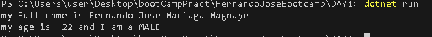

# FernandoJoseBootcamp :grinning:

## **day 1!** :upside_down_face: :poop: :banana:

    - [X] Basic Lesson 1: variables and Console.Writeline("") 
         ### 
         
    - [ ] Basic Lesson 2:

## **day 2!** :baby: :ninja:
### create new mvc.net file using the pallete and run the web page demo


## **day 3!** :smile::knife:
- [ ] to be accomplish


### trouble shooting
removing cached/nested repository
```
git rm -r --cached [name of the folder]

```
### ADDITIONAL
FILE relative linking 
```
    
    
```

> [!NOTE]
>see the other sample in journal including Note, Tip, Important, Warning and Caution
>[GITHUB and GIT JOURNAL](journal.md)


HOW TO MAKE README.md BEAUTIFUL look [Format readme.md](https://docs.github.com/en/get-started/writing-on-github/getting-started-with-writing-and-formatting-on-github/basic-writing-and-formatting-syntax).


